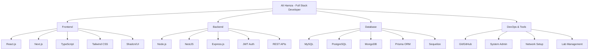

# 👋 Hi there! I'm **Ali Hamza**

<div align="center">


[](https://ali-hamza-portfolio.vercel.app)
[](https://github.com/Ali-Hamza-52)
[](https://www.linkedin.com/in/ali-hamza-webdeveloper)
[](mailto:alihamzabrw52@gmail.com)

</div>

---

## 🚀 About Me

> **Passionate Full Stack Developer** from Jeddah, KSA, specializing in building scalable, high-performance web applications.

- 🔭 Currently working at **Glorek International Co.** as Full Stack Developer
- 🌱 Always learning cutting-edge technologies and best practices
- 🏆 **District-level Speed Coding Champion** - recognized for exceptional problem-solving speed
- 💡 Love mentoring developers and sharing knowledge through teaching
- ⚡ **3+ years** of professional development experience
- 🎯 Focused on creating impactful solutions that drive business growth

---

## 🛠️ Technology Arsenal

### **Frontend Development**
```
React.js ████████████████████ 95%
Next.js  ████████████████████ 90%
TypeScript ██████████████████ 85%
Tailwind CSS ████████████████ 90%
HTML/CSS ████████████████████ 95%
```

### **Backend Development**
```
Node.js    ████████████████████ 90%
NestJS     ██████████████████   85%
Express.js ████████████████████ 90%
REST APIs  ██████████████████   85%
GraphQL    ██████████████       65%
```

### **Database & ORM**
```
MySQL      ████████████████████ 90%
PostgreSQL ██████████████████   85%
MongoDB    ████████████████████ 90%
Prisma     ██████████████████   85%
Sequelize  ██████████████████   80%
```

### **Programming Languages**
```
JavaScript ████████████████████ 95%
TypeScript ██████████████████   85%
Python     ████████████████     75%
Java       █████████████████    70%
C++        ███████████████      65%
```

<div align="center">

### **Tech Stack Visualization**



</div>

---

## 💼 Professional Journey

### 🚀 **Glorek International Co.** - *Full Stack Developer*
**📍 Jeddah, KSA | 📅 Jul 2025 – Present**
- 🏗️ Architected **enterprise-grade web applications** using Next.js, Node.js, NestJS & MySQL
- 🔐 Implemented **JWT authentication & RBAC** systems, enhancing security protocols
- ⚡ Designed scalable **REST APIs** and optimized backend performance
- 🎨 Enhanced UI/UX with **Tailwind CSS + Shadcn/UI**, boosting user engagement by **20%**

### 👨‍🏫 **Online Web Development Instructor** - *Remote*
**📍 Remote | 📅 Dec 2024 – May 2025**
- 📚 Conducted **live MERN & Next.js training sessions** for 50+ students
- 📝 Designed comprehensive **curriculum & hands-on projects**
- 💡 Provided **mentoring & code reviews** to guide students toward industry standards

### 🌟 **Realized Software's** - *Associate Web Developer*
**📍 USA (Remote) | 📅 Aug 2024 – Nov 2024**
- 🚀 Delivered complete **full-stack solution** with Next.js, NestJS, PostgreSQL
- 🔒 Integrated **enterprise authentication** and role-based access control
- 📱 Optimized performance and ensured **mobile responsiveness**

### 💡 **Zacoders** - *Intern Full-Stack Developer*
**📍 Pakistan | 📅 Mar 2024 – Aug 2024**
- ⚛️ Built **modern web applications** using React, Next.js, Node.js, MongoDB
- 🔄 Developed responsive UIs and integrated APIs in **production environments**

### 🖥️ **GGCB Burewala** - *Lab Coordinator*
**📍 Pakistan | 📅 Jan 2022 – Apr 2025**
- 🔧 Managed computer labs: **hardware maintenance, OS installation, troubleshooting**
- 🌐 Provided comprehensive **IT support** and network setup services
- 👥 Supported faculty and students with **on-site and remote** technical assistance

---

## 🏆 Achievements & Recognition

<div align="center">

| 🏅 Achievement | 📝 Description |
|:---|:---|
| **🥇 Speed Coding Champion** | Winner at District Level Competition |
| **⚡ Problem Solver** | Solved algorithmic challenges with speed & accuracy |
| **👨‍🎓 Academic Excellence** | BS IT with CGPA 3.76/4.0 |
| **📈 Performance Impact** | Improved user engagement by 20% in recent project |

</div>

---

## 📊 GitHub Analytics

<div align="center">


</div>

---

## 🎓 Education

**🎓 Bachelor of Science in Information Technology**  
*Bahauddin Zakariya University | 2020 – 2024*  
**CGPA: 3.76 / 4.0** 🌟

---

## 🌟 Featured Projects

<div align="center">

| Project | Tech Stack | Description |
|:---:|:---:|:---|
| **🏢 Enterprise Web App** | Next.js, NestJS, MySQL | Full-scale enterprise solution with RBAC |
| **📚 Learning Platform** | MERN Stack | Educational platform for web development |
| **🔐 Auth System** | JWT, Node.js, PostgreSQL | Secure authentication microservice |

</div>

---

## 📈 Skills Proficiency Chart

```
Full Stack Development  ████████████████████ 90%
Frontend Development   ████████████████████ 95%
Backend Development    ██████████████████   85%
Database Management    ██████████████████   85%
System Administration ███████████████████  80%
Problem Solving        ████████████████████ 95%
Team Leadership        ███████████████████  80%
Teaching & Mentoring   ██████████████████   85%
```

---

## 🤝 Let's Connect!

<div align="center">

**"Building the future, one line of code at a time"** ✨

[](https://ali-hamza-portfolio.vercel.app)
[](mailto:alihamzabrw52@gmail.com)
[](https://www.linkedin.com/in/ali-hamza-webdeveloper)
[](https://github.com/Ali-Hamza-52)

---

### ⚡ Fun Fact
When I'm not crafting exceptional web experiences, you'll find me exploring new technologies, solving complex algorithms, or mentoring the next generation of developers. I believe in continuous learning and sharing knowledge to build a stronger tech community! 🚀

---

**🔥 "Code is like humor. When you have to explain it, it's bad." - Cory House**


</div>
